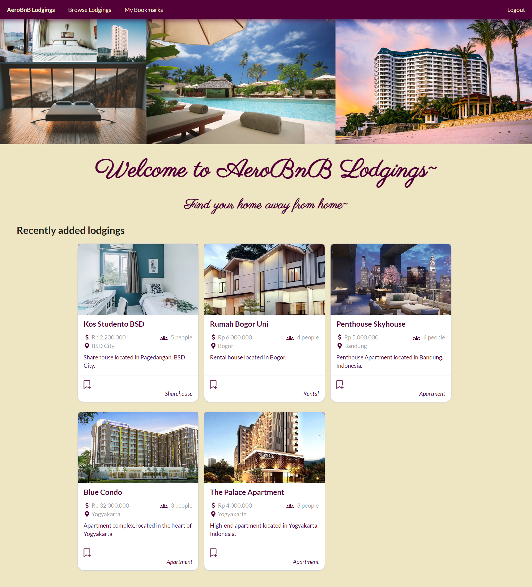
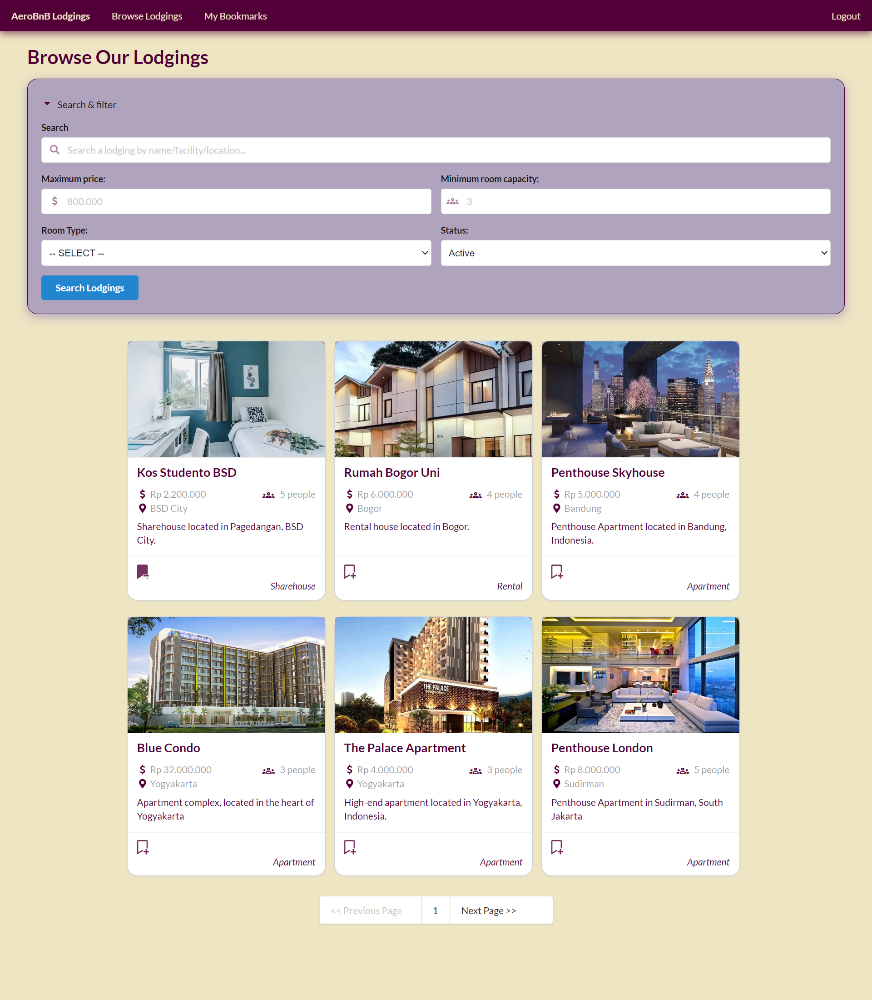
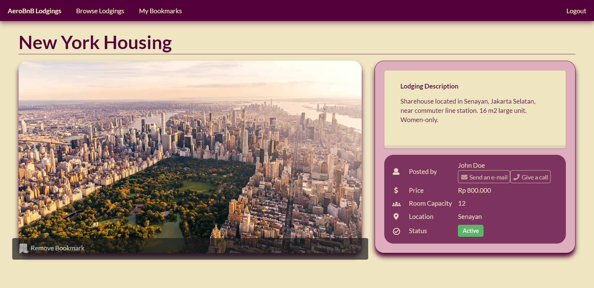
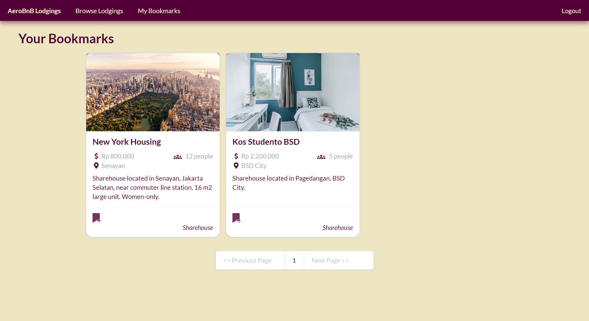

# Lodgings App

A client application for a lodgings rental platform (customer-facing application). Use alongside the server application [lodgings-app-server](https://github.com/ValYauw/lodgings-app-server).

Tech stack:
 - Vue.js
 - Pinia (State Management)
 - Semantic UI (CSS Library)
 - Axios
 - Vue Toast Notification

Main features:
 - OAuth user authentication
 - User Bookmarks
 - Pagination
 - CSS & layouting: Responsive Design

## Demo Screenshots

### Homepage

### Read Entities

### User bookmarks
